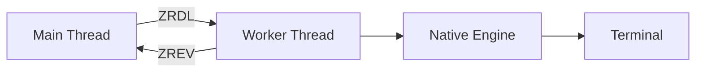
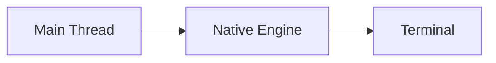

`@rezi-ui/node` is the Node.js/Bun backend for Rezi. This package owns terminal I/O, worker thread lifecycle, frame scheduling, and buffer transport between the TypeScript core and the native engine.

## Overview

**Responsibilities:**
- Configurable native engine execution mode (`auto` | `worker` | `inline`)
- Frame scheduling and buffer pooling
- Transfer of drawlists/events between core and native addon
- Terminal profile detection and capability negotiation

**Does NOT own:**
- Widget logic, layout math (lives in `@rezi-ui/core`)
- Terminal rendering (lives in native Zireael engine)

## Creating a Backend

### Recommended: `createNodeApp()`

```typescript
import { createNodeApp } from "@rezi-ui/node";

const app = createNodeApp({
  initialState: { count: 0 },
  config: {
    fpsCap: 30,
    executionMode: "auto"
  }
});

app.mount((state) => ui.text(`Count: ${state.count}`));
app.run();
```

**Benefits:**
- Wires `@rezi-ui/core` and `@rezi-ui/node` with matched cursor protocol, event caps, and FPS settings
- Automatic execution mode selection
- Hot reload support

### Direct Backend Creation

```typescript
import { createNodeBackend } from "@rezi-ui/node";

const backend = createNodeBackend({
  config: {
    executionMode: "worker",
    fpsCap: 60,
    drawlistVersion: 5
  }
});

await backend.init();
// ... use backend with core API
await backend.destroy();
```

**Use for:** Benchmarks, custom runners, or when you need direct access to a backend instance.

## Execution Modes

The backend supports three execution modes:

| Mode | Description | Best for |
|------|-------------|----------|
| **`auto`** | Selects `inline` when `fpsCap <= 30`, otherwise `worker` | Default choice |
| **`worker`** | Native engine runs on dedicated worker thread | High FPS, responsive apps |
| **`inline`** | Engine runs on main thread | Low FPS, minimal overhead |

### Auto Mode

Automatic mode selection logic:

```typescript
if (fpsCap <= 30) {
  // Use inline mode
  // Lower latency, acceptable blocking at 30 FPS
} else {
  // Use worker mode
  // Main thread never blocks on I/O
}
```

### Worker Mode

**Architecture:**



**Benefits:**
- Main thread never blocks on terminal I/O
- Better for high FPS (60+)
- Parallel rendering and event processing

**Costs:**
- Worker thread spawn overhead (~5-10ms)
- Buffer transfer overhead
- Slightly higher memory usage

**Frame Transport:**
- **Transfer mode:** Copy drawlist buffer via `postMessage` with transfer
- **SAB mode:** Write to SharedArrayBuffer mailbox (when available)

### Inline Mode

**Architecture:**



**Benefits:**
- Lower latency (no worker hop)
- Lower memory overhead
- Simpler debugging

**Costs:**
- Main thread blocks during terminal I/O
- Not suitable for high FPS

**Use for:** 30 FPS or lower, CLI tools, dashboards

## Frame Transport

When using worker mode, drawlists are transferred to the worker thread via one of two mechanisms:

### Transfer Mode (default)

**Mechanism:** Copy drawlist `ArrayBuffer` via `postMessage` with `[buffer]` transfer list.

**Pros:**
- Works everywhere (no SharedArrayBuffer requirement)
- Zero-copy transfer of ownership

**Cons:**
- Main thread cannot reuse buffer immediately
- Slight latency from `postMessage`

### SAB Mode

**Mechanism:** Write drawlist to pre-allocated SharedArrayBuffer mailbox slot.

**Pros:**
- No transfer overhead
- Main thread can immediately reuse builder
- Better for high-frequency updates

**Cons:**
- Requires `SharedArrayBuffer` support (Node.js 16+, or `--experimental-shared-array-buffer`)
- Slightly higher memory usage (pre-allocated slots)

**Configuration:**

```typescript
const backend = createNodeBackend({
  config: {
    frameTransport: "sab",
    frameSabSlotCount: 8,       // Default: 8 slots
    frameSabSlotBytes: 1048576  // Default: 1 MiB per slot
  }
});
```

**Mailbox slots:** The SAB mailbox has `N` slots. Each slot can hold one drawlist up to `M` bytes. If all slots are full, the backend falls back to transfer mode for that frame.

## Backend Configuration

```typescript
interface NodeBackendConfig {
  executionMode?: "auto" | "worker" | "inline";
  fpsCap?: number;
  maxEventBytes?: number;
  drawlistVersion?: 2 | 3 | 4 | 5;
  frameTransport?: "auto" | "transfer" | "sab";
  frameSabSlotCount?: number;
  frameSabSlotBytes?: number;
  emojiWidthPolicy?: "auto" | "wide" | "narrow";
  nativeConfig?: Record<string, unknown>;
}
```

### Key Options

**`executionMode`** — Worker vs. inline execution (default: `"auto"`)  
**`fpsCap`** — Maximum frames per second (default: `30`)  
**`drawlistVersion`** — ZRDL format version (default: `5`)  
**`frameTransport`** — Transfer mechanism for worker mode (default: `"auto"`)  
**`emojiWidthPolicy`** — Emoji cell width policy (default: `"auto"`)  

**See:** Backend API reference for full details

## Terminal Profile Detection

The backend detects terminal capabilities from environment variables:

**Detected from:**
- `TERM` — Terminal type (`xterm-256color`, `screen`, etc.)
- `COLORTERM` — Truecolor support (`truecolor`, `24bit`)
- `TERM_PROGRAM` — Terminal emulator name (`iTerm.app`, `vscode`, etc.)
- `CI` / `GITHUB_ACTIONS` / `GITLAB_CI` — CI environment detection

**Capabilities:**
- `truecolor` — 24-bit RGB color support
- `unicode` — Unicode rendering support
- `mouse` — Mouse event support
- `focus` — Focus tracking support

**Defaults:**

```typescript
const DEFAULT_TERMINAL_CAPS: TerminalCaps = {
  truecolor: true,
  unicode: true,
  mouse: true,
  focus: true
};
```

**Location:** `packages/node/src/backend/terminalProfile.ts`

## Emoji Width Policy

The backend aligns core text measurement with native rendering for emoji clusters:

| Policy | Behavior |
|--------|----------|
| `"auto"` | Use native/env overrides; optional probe when `ZRUI_EMOJI_WIDTH_PROBE=1`; fallback to "wide" |
| `"wide"` | Emoji clusters consume 2 cells |
| `"narrow"` | Emoji clusters consume 1 cell |

**Environment variables:**
- `ZRUI_EMOJI_WIDTH=wide` / `narrow` — Explicit override
- `ZRUI_EMOJI_WIDTH_PROBE=1` — Enable terminal probing

**Location:** `packages/node/src/backend/emojiWidthPolicy.ts`

## Lifecycle

### Initialization

```typescript
const backend = createNodeBackend({ config });
await backend.init();
```

**Steps:**
1. Detect terminal profile
2. Apply emoji width policy
3. Spawn worker thread (if worker mode)
4. Initialize native engine
5. Negotiate capabilities

### Frame Submission

```typescript
const drawlist = builder.build();
if (drawlist.ok) {
  await backend.requestFrame(drawlist.bytes);
}
```

**Steps:**
1. Transfer drawlist to worker (or submit inline)
2. Worker submits to native engine
3. Engine validates and executes drawlist
4. Engine diffs framebuffers and emits ANSI
5. Engine writes ANSI to terminal

### Event Polling

```typescript
backend.pollEvents((batch) => {
  const events = parseZrevBatch(batch);
  // Handle events
});
```

**Steps:**
1. Engine polls terminal for input
2. Engine parses raw bytes into ZREV events
3. Engine builds ZREV batch
4. Worker transfers batch to main thread
5. Core parses and routes events

### Cleanup

```typescript
await backend.destroy();
```

**Steps:**
1. Signal worker to terminate
2. Wait for worker exit
3. Destroy native engine
4. Restore terminal state

## Debug API

The backend exposes a debug API:

```typescript
const stats = await backend.debug.getStats();
console.log(stats);

const result = await backend.debug.query({ command: "ping" });
console.log(result);
```

**Stats:**
- Frame count
- Event count
- Bytes transferred
- Worker thread status

**Location:** `packages/node/src/backend/nodeBackend.ts`

## Performance Monitoring

When `REZI_PERF=1` is set:

```typescript
const snapshot = await backend.perf.perfSnapshot();
console.log(snapshot.phases);
```

**Tracked phases:**
- `poll` — Event polling time
- `present` — Frame present time
- `transfer` — Buffer transfer time

**Metrics per phase:**
- `count`, `avg`, `p50`, `p95`, `p99`, `max`, `worst10`

## Related Documentation

- [Worker Model](/architecture/backend/worker-model) — Thread ownership and backpressure
- [Native Addon](/architecture/backend/native) — N-API binding details
- [Terminal Detection](/architecture/backend/terminal-detection) — Capability detection
- [Protocol Overview](/architecture/protocol/overview) — Binary formats
