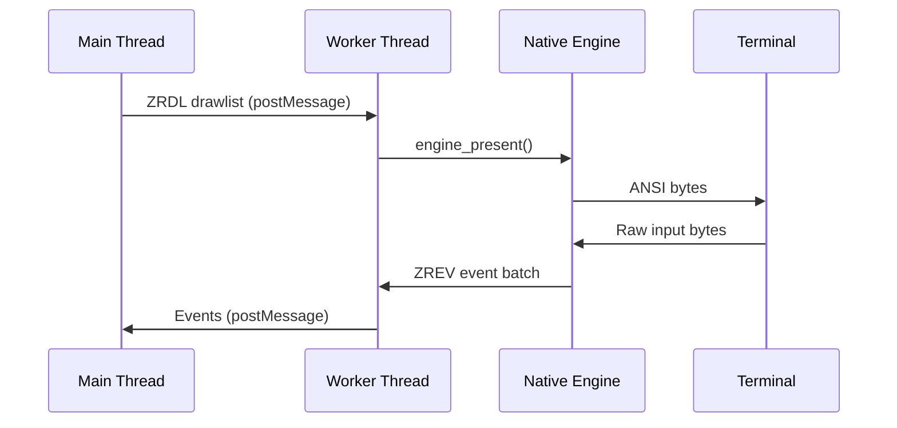

When using worker execution mode, the native Zireael engine runs on a dedicated worker thread. This page documents the thread ownership model, frame transport mechanisms, and backpressure handling.

## Architecture



## Thread Ownership

### Main Thread Owns

- Application state
- VNode tree construction
- Layout computation
- Focus management
- Drawlist builder
- Event parsing and routing

### Worker Thread Owns

- Native engine instance
- Terminal I/O (read/write)
- Frame scheduling
- Event polling loop
- Frame transport buffers (when using SAB)

**Key invariant:** The native engine handle never crosses thread boundaries. All FFI calls occur on the worker thread.

## Frame Transport

Frames (ZRDL drawlists) are transferred from main to worker via one of two mechanisms:

### Transfer Mode

**Mechanism:** Copy drawlist `ArrayBuffer` via `postMessage` with `[buffer]` transfer list.

**Flow:**

```typescript
// Main thread
const drawlist = builder.build();
if (drawlist.ok) {
  worker.postMessage(
    { type: "frame", buffer: drawlist.bytes.buffer },
    [drawlist.bytes.buffer]  // Transfer ownership
  );
}

// Worker thread
worker.on("message", (msg) => {
  if (msg.type === "frame") {
    const result = engine_present(engineHandle, new Uint8Array(msg.buffer));
    // ...
  }
});
```

**Pros:**
- Works everywhere (no SharedArrayBuffer requirement)
- Zero-copy transfer of ownership

**Cons:**
- Main thread cannot reuse buffer immediately
- Slight latency from `postMessage`

### SAB Mailbox Mode

**Mechanism:** Write drawlist to pre-allocated SharedArrayBuffer mailbox slot.

**Structure:**

```
[Control Header: N words]
[Slot 0: M bytes]
[Slot 1: M bytes]
...
[Slot N-1: M bytes]
```

**Control header (per slot):**
- `state` (u32) — 0=FREE, 1=WRITING, 2=READY
- `publishedSeq` (u32) — Sequence number of published frame
- `publishedToken` (u32) — Token for validation
- `publishedBytes` (u32) — Byte length of drawlist
- `consumedSeq` (u32) — Sequence number of consumed frame

**Flow:**

```typescript
// Main thread
function submitFrame(drawlist: Uint8Array) {
  // Find free slot
  const slot = findFreeSlot();
  if (slot === null) {
    // Fallback to transfer mode
    return;
  }
  
  // Mark slot as WRITING
  Atomics.store(control, slot * WORDS_PER_SLOT + STATE_WORD, WRITING);
  
  // Copy drawlist to slot
  mailbox.set(drawlist, slot * SLOT_BYTES);
  
  // Mark slot as READY
  Atomics.store(control, slot * WORDS_PER_SLOT + STATE_WORD, READY);
  Atomics.store(control, slot * WORDS_PER_SLOT + PUBLISHED_BYTES_WORD, drawlist.length);
  
  // Notify worker
  Atomics.notify(control, slot * WORDS_PER_SLOT + STATE_WORD);
}

// Worker thread
function pollMailbox() {
  for (let slot = 0; slot < SLOT_COUNT; slot++) {
    const state = Atomics.load(control, slot * WORDS_PER_SLOT + STATE_WORD);
    if (state === READY) {
      // Read drawlist from slot
      const bytes = Atomics.load(control, slot * WORDS_PER_SLOT + PUBLISHED_BYTES_WORD);
      const drawlist = new Uint8Array(mailbox.buffer, slot * SLOT_BYTES, bytes);
      
      // Submit to engine
      engine_present(engineHandle, drawlist);
      
      // Mark slot as FREE
      Atomics.store(control, slot * WORDS_PER_SLOT + STATE_WORD, FREE);
    }
  }
}
```

**Pros:**
- Zero-copy submission
- Main thread can immediately reuse builder
- Lower latency than `postMessage`

**Cons:**
- Requires `SharedArrayBuffer` support
- Slightly higher memory usage (pre-allocated slots)

**Configuration:**

```typescript
const backend = createNodeBackend({
  config: {
    frameTransport: "sab",
    frameSabSlotCount: 8,       // Default: 8 slots
    frameSabSlotBytes: 1048576  // Default: 1 MiB per slot
  }
});
```

**Location:** `packages/node/src/worker/protocol.ts`

## Backpressure Handling

### Frame Skipping

When frames arrive faster than the worker can process them:

**Strategy:** Skip intermediate frames, always present the latest frame.

```typescript
let latestFrame: Uint8Array | null = null;

worker.on("message", (msg) => {
  if (msg.type === "frame") {
    // Overwrite previous frame
    latestFrame = new Uint8Array(msg.buffer);
  }
});

function workerLoop() {
  if (latestFrame !== null) {
    engine_present(engineHandle, latestFrame);
    latestFrame = null;
  }
  
  setImmediate(workerLoop);
}
```

**Result:** FPS drops but app stays responsive. No unbounded queue growth.

### SAB Mailbox Saturation

When all mailbox slots are full:

**Strategy:** Fall back to transfer mode for that frame.

```typescript
function submitFrame(drawlist: Uint8Array) {
  const slot = findFreeSlot();
  
  if (slot === null) {
    // All slots full; use transfer mode
    worker.postMessage(
      { type: "frame", buffer: drawlist.buffer },
      [drawlist.buffer]
    );
    return;
  }
  
  // Use SAB mailbox
  writeToSlot(slot, drawlist);
}
```

**Result:** Graceful degradation under load.

### Event Batching

Events are batched into ZREV batches to reduce `postMessage` overhead:

```typescript
function pollEvents() {
  const buffer = new Uint8Array(64 * 1024); // 64 KiB
  const bytesRead = engine_poll_events(engineHandle, buffer);
  
  if (bytesRead > 0) {
    // Send entire batch to main thread
    parentPort.postMessage(
      { type: "events", buffer: buffer.buffer.slice(0, bytesRead) },
      [buffer.buffer]
    );
  }
}
```

**Benefit:** Amortize `postMessage` cost across multiple events.

## Worker Lifecycle

### Initialization

```typescript
// Main thread
const worker = new Worker("./engineWorker.js", { workerData });

worker.on("message", (msg) => {
  if (msg.type === "ready") {
    // Worker initialized
  }
});

// Worker thread
const engineHandle = engine_create(config);
parentPort.postMessage({ type: "ready" });
```

### Frame Loop

```typescript
// Worker thread
function workerLoop() {
  // Poll for input events
  pollEvents();
  
  // Process mailbox frames
  if (usesSabMailbox) {
    pollMailbox();
  }
  
  // Schedule next iteration
  const delay = computeNextIdleDelay(fpsCap);
  setTimeout(workerLoop, delay);
}

workerLoop();
```

**Tick timing:** Computed based on `fpsCap`:

```typescript
function computeNextIdleDelay(fpsCap: number): number {
  const targetFrameMs = 1000 / fpsCap;
  const elapsedMs = performance.now() - lastFrameTime;
  return Math.max(0, targetFrameMs - elapsedMs);
}
```

**Location:** `packages/node/src/worker/tickTiming.ts`

### Shutdown

```typescript
// Main thread
worker.postMessage({ type: "shutdown" });

await new Promise<void>((resolve) => {
  worker.on("exit", () => resolve());
});

// Worker thread
worker.on("message", (msg) => {
  if (msg.type === "shutdown") {
    engine_destroy(engineHandle);
    process.exit(0);
  }
});
```

## Message Protocol

### Main → Worker

```typescript
type MainToWorkerMessage =
  | { type: "frame"; buffer: ArrayBuffer }
  | { type: "shutdown" }
  | { type: "debug"; query: DebugQuery };
```

### Worker → Main

```typescript
type WorkerToMainMessage =
  | { type: "ready" }
  | { type: "events"; buffer: ArrayBuffer }
  | { type: "error"; error: string }
  | { type: "debugResult"; result: DebugQueryResult };
```

**Location:** `packages/node/src/worker/protocol.ts`

## Performance Considerations

### Worker Spawn Overhead

Spawning a worker thread has ~5-10ms overhead on Node.js 18.

**Mitigation:** Use `auto` mode, which prefers inline for low FPS.

### `postMessage` Latency

`postMessage` with transfer has ~0.1-0.5ms latency.

**Mitigation:** Use SAB mailbox mode for high-frequency updates.

### Memory Overhead

Worker mode uses ~20-40 MB more memory than inline mode (worker runtime + buffers).

**Acceptable for:** Interactive apps where responsiveness matters.

## Related Documentation

- [Node.js Backend](/architecture/backend/node) — Backend implementation
- [Native Addon](/architecture/backend/native) — N-API binding
- [Benchmarks](/architecture/benchmarks) — Worker vs. inline performance
