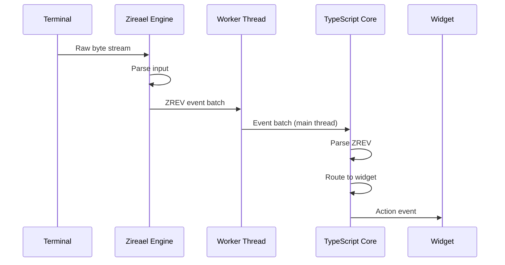

Rezi's event system routes terminal input events (keyboard, mouse, resize) to widgets through a capability-based routing model. Events flow from the native engine to the TypeScript core via ZREV batches.

## Event Flow



## ZREV Event Batches

The engine emits events as ZREV binary batches containing one or more event records.

### Event Record Types

| Record Kind | Description | Fields |
|-------------|-------------|--------|
| **Key** | Keyboard input | `keyCode`, `mods`, `text` |
| **Mouse** | Mouse events | `x`, `y`, `mouseKind`, `buttons`, `wheelX`, `wheelY` |
| **Resize** | Terminal size change | `cols`, `rows` |
| **Tick** | Animation frame timer | `deltaNs` |

**Binary format:** See [ZREV Protocol](/architecture/protocol/zrev)

### Event Parsing

**Location:** `packages/core/src/events.ts`

```typescript
interface ZrevEvent {
  kind: "key" | "mouse" | "resize" | "tick";
  // ... kind-specific fields
}

function parseZrevBatch(buffer: Uint8Array): ZrevEvent[]
```

**Safety:**
- No reads past buffer end
- No unbounded allocations from untrusted sizes
- Explicit structured errors (no exceptions)

## Key Events

### Key Event Structure

```typescript
interface KeyEvent {
  kind: "key";
  keyCode: number;         // ZR_KEY_* constant
  mods: number;            // Bitmask of ZR_MOD_*
  text: string;            // UTF-8 text (if printable)
}
```

### Key Codes

Defined in `packages/core/src/keybindings/keyCodes.ts`:

| Key | Code | Notes |
|-----|-----:|-------|
| `ZR_KEY_ESCAPE` | 1 | |
| `ZR_KEY_ENTER` | 2 | |
| `ZR_KEY_TAB` | 3 | |
| `ZR_KEY_BACKSPACE` | 4 | |
| `ZR_KEY_UP` | 20 | Arrow keys |
| `ZR_KEY_DOWN` | 21 | |
| `ZR_KEY_LEFT` | 22 | |
| `ZR_KEY_RIGHT` | 23 | |
| `ZR_KEY_F1` ... `ZR_KEY_F12` | 100-111 | Function keys |

Printable ASCII keys use their codepoints (32-126).

### Modifier Bitmask

```typescript
const ZR_MOD_SHIFT = 1 << 0;  // 0x01
const ZR_MOD_CTRL  = 1 << 1;  // 0x02
const ZR_MOD_ALT   = 1 << 2;  // 0x04
const ZR_MOD_META  = 1 << 3;  // 0x08
```

### Keybinding Matching

Applications register keybindings via `app.keys()`:

```typescript
app.keys({
  "ctrl+c": () => app.quit(),
  "ctrl+s": () => app.update(s => ({ ...s, saved: true })),
  "enter": () => app.update(s => ({ ...s, submitted: true }))
});
```

**Matching algorithm:**

1. Parse keybinding string into `ParsedKey` (code + mods)
2. Build trie from keybindings for efficient lookup
3. On key event, match `(keyCode, mods)` against trie
4. Support multi-key chords (e.g., `"ctrl+k ctrl+s"`)

**Location:** `packages/core/src/keybindings/index.ts`

## Mouse Events

### Mouse Event Structure

```typescript
interface MouseEvent {
  kind: "mouse";
  x: number;               // Column (0-based)
  y: number;               // Row (0-based)
  mouseKind: MouseKind;    // Event type
  mods: number;            // Modifier bitmask
  buttons: number;         // Button state bitmask
  wheelX: number;          // Horizontal scroll delta
  wheelY: number;          // Vertical scroll delta
}

type MouseKind = "move" | "drag" | "down" | "up" | "wheel";
```

### Mouse Kind Values

| Kind | Value | Description |
|------|------:|-------------|
| `move` | 1 | Mouse moved without button pressed |
| `drag` | 2 | Mouse moved with button pressed |
| `down` | 3 | Button pressed |
| `up` | 4 | Button released |
| `wheel` | 5 | Scroll wheel moved |

### Hit Testing

Mouse events are routed to widgets via hit testing:

```typescript
function hitTestFocusable(
  layoutTree: LayoutTree,
  x: number,
  y: number
): InstanceId | null
```

**Algorithm:**
1. Find deepest widget at `(x, y)` that is focusable
2. Check bounding box containment
3. Respect clipping bounds
4. Return widget instance ID

**Location:** `packages/core/src/layout/hitTest.ts`

### Mouse Action Routing

Mouse events generate widget actions:

| Mouse Event | Widget Capability | Action |
|-------------|-------------------|--------|
| `down` on Button | `pressable` | `press` |
| `down` on Input | `focusable` | Focus change |
| `wheel` in scroll region | `scrollable` | `scroll` |
| `down` on Table row | `rowPressable` | `rowPress` |

**Location:** `packages/core/src/app/widgetRenderer.ts`

## Wheel Event Routing

Mouse wheel events route to the nearest scrollable ancestor.

### Scroll Target Detection

```typescript
interface ScrollTarget {
  instanceId: InstanceId;
  bounds: Rect;
  scrollX: number;
  scrollY: number;
  maxScrollX: number;
  maxScrollY: number;
}
```

**Algorithm:**
1. Hit test at wheel event `(x, y)`
2. Walk up ancestor chain from hit widget
3. Find first ancestor with `overflow: "scroll"`
4. Apply scroll delta to that widget

**Location:** `packages/core/src/runtime/router/wheel.ts`

## Event Routing to Widgets

Widgets receive events via action system:

```typescript
app.on("event", (ev) => {
  if (ev.action === "press" && ev.id === "submit-button") {
    app.update(s => ({ ...s, submitted: true }));
  }
});
```

### Action Types

| Action | Emitted By | Trigger |
|--------|------------|----------|
| `press` | Button, Checkbox | Mouse down or Enter key |
| `input` | Input | Text input |
| `select` | Select, Dropdown | Item chosen |
| `toggle` | Checkbox, Switch | State toggled |
| `change` | Input, Select | Value changed |
| `activate` | List item | Enter or click |
| `scroll` | ScrollView | Wheel event |
| `rowPress` | Table | Row clicked |

### Action Event Structure

```typescript
interface ActionEvent {
  action: string;          // Action type
  id: string;              // Widget ID
  // ... action-specific fields
}
```

**Examples:**

```typescript
// Press action
{ action: "press", id: "submit-btn" }

// Input action
{ action: "input", id: "username", value: "alice" }

// Select action
{ action: "select", id: "theme-select", value: "dark" }

// Scroll action
{ action: "scroll", id: "log-viewer", scrollY: 42 }
```

## Input Widget Editing

Input widgets handle text editing directly in the event system.

### Input State

```typescript
interface InputEditorSnapshot {
  text: string;
  cursor: number;          // Cursor position (grapheme index)
  selection?: InputSelection;
}

interface InputSelection {
  start: number;           // Start of selection (grapheme index)
  end: number;             // End of selection
}
```

### Edit Events

Key events are translated to edit operations:

| Key | Modifier | Operation |
|-----|----------|------------|
| Printable char | None | Insert at cursor |
| Backspace | None | Delete before cursor |
| Delete | None | Delete after cursor |
| Left | None | Move cursor left |
| Right | None | Move cursor right |
| Home | None | Move to start |
| End | None | Move to end |
| Left/Right | Shift | Extend selection |
| Ctrl+A | None | Select all |

**Location:** `packages/core/src/runtime/inputEditor.ts`

### Undo Stack

Input widgets maintain undo/redo stacks:

```typescript
interface InputUndoStack {
  past: InputEditorSnapshot[];
  future: InputEditorSnapshot[];
  maxDepth: number;        // Default: 50
}
```

**Operations:**
- Ctrl+Z: Undo
- Ctrl+Y / Ctrl+Shift+Z: Redo

## Resize Events

Terminal resize events trigger full re-layout:

```typescript
interface ResizeEvent {
  kind: "resize";
  cols: number;            // New column count
  rows: number;            // New row count
}
```

**Handling:**
1. Update viewport dimensions
2. Trigger full layout pass
3. Re-render entire tree

## Tick Events

Animation frame events for declarative animations:

```typescript
interface TickEvent {
  kind: "tick";
  deltaNs: number;         // Nanoseconds since last tick
}
```

**Used by:**
- `useTransition()` — declarative state transitions
- `useSpring()` — physics-based animations
- `useSequence()` — animation sequences

**Frame rate:** Configurable via `fpsCap` (default: 30 FPS)

## Event Caps

Event batches have configurable size limits:

```typescript
const config = {
  maxEventBytes: 64 * 1024  // 64 KiB default
};
```

**Enforcement:**
- Engine enforces cap when building ZREV batches
- Events exceeding cap are dropped (with warning)
- Prevents unbounded memory allocation

## Focus Management

Focus state determines which widget receives keyboard events.

### Focus Traversal

**Tab:** Move focus forward  
**Shift+Tab:** Move focus backward

**Algorithm:**
1. Collect all focusable widgets in depth-first order
2. Find current focused widget
3. Move to next/previous in list (wrapping at edges)

**Location:** `packages/core/src/runtime/focus.ts`

### Focus Events

Widgets are notified of focus changes:

```typescript
app.on("event", (ev) => {
  if (ev.action === "focus" && ev.id === "username-input") {
    // Input gained focus
  }
});
```

## Related Documentation

- [ZREV Protocol](/architecture/protocol/zrev) — Binary event format
- [Mouse Support Guide](/guides/mouse-support) — Mouse interaction patterns
- [Keybindings Reference](/guides/input-focus) — Keybinding API
- [Input Widgets](/widgets/input) — Input widget editing
