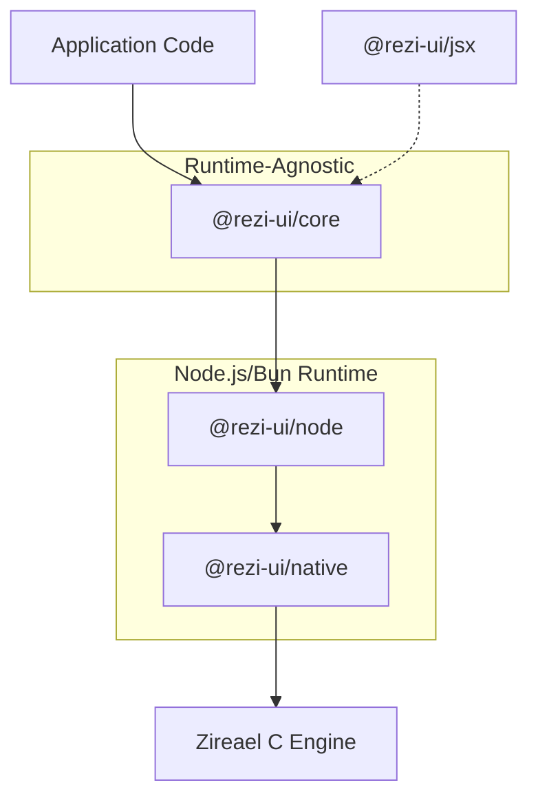

Rezi is a layered terminal UI framework that separates concerns across runtime-agnostic TypeScript core, Node.js/Bun backend, and native C rendering engine. This design enables deterministic rendering, high performance, and cross-runtime portability.

## Stack Layers



| Layer | Responsibilities | Does NOT own |
|-------|------------------|-------------|
| **@rezi-ui/core** | Widget tree, layout engine, themes, keybindings, forms, drawlist encoding, event parsing | Terminal I/O, threads, OS APIs |
| **@rezi-ui/node** | Worker thread lifecycle, frame scheduling, buffer transport, execution mode selection | Widget logic, layout math |
| **@rezi-ui/native** | N-API binding, Zireael engine lifecycle, SharedArrayBuffer interop | Protocol semantics |
| **Zireael (C)** | Framebuffer management, diff rendering, ANSI emission, terminal capability detection, platform I/O | Widget definitions, layout, themes |

## Data Flow

A single frame follows this path through the system:

```
1. Event Dispatch
   Terminal input → Zireael parses raw bytes → ZREV event batch →
   worker thread → main thread → app event handlers

2. State Update
   Event handler calls app.update() → state transitions queued →
   batched into single commit at next commit point

3. Render
   view(state) called → VNode tree produced → reconciliation →
   layout computed (cell coordinates) → focus resolved

4. Drawlist Encoding
   Render output → ZRDL binary drawlist (commands: clear, fill_rect,
   draw_text, push_clip, pop_clip, set_cursor)

5. Present
   Drawlist transferred to worker → worker submits to Zireael →
   Zireael diffs prev/next framebuffers → emits minimal ANSI bytes →
   single write to terminal
```

## Binary Protocol Boundary

The native engine communicates exclusively through two binary formats:

- **ZRDL** (drawlists): rendering commands flowing *down* from TypeScript to the engine
- **ZREV** (event batches): input events flowing *up* from the engine to TypeScript

Both formats are:
- Little-endian
- 4-byte aligned
- Versioned with magic bytes (`ZRDL` = `0x4C44525A`, `ZREV` = `0x5645525A`)
- Strictly validated at both ends

Mismatched versions produce deterministic errors at the boundary—no silent data corruption.

## Design Constraints

**No Node.js APIs in core.** `@rezi-ui/core` must remain runtime-agnostic. It contains no `Buffer`, `worker_threads`, `fs`, or `node:*` imports. This is enforced by CI.

**Binary boundary for safety.** All data crossing the native boundary goes through versioned binary formats with strict validation. No raw pointers or shared mutable state cross the TypeScript/C boundary.

**Deterministic rendering.** Same initial state + same event sequence = same frames. This is achieved through:
- Pinned Unicode tables (v15.1.0)
- Versioned protocols
- Strict commit-point semantics
- Deterministic layout algorithms

**No per-frame heap churn.** The engine pre-allocates framebuffers, output buffers, and event queues at creation time. The diff renderer operates on caller-provided buffers with no dynamic allocation.

**Single flush per present.** `engine_present()` writes exactly one chunk to the terminal on success, zero on failure. No partial ANSI sequences reach the terminal.

## Comparison with Other Frameworks

### vs Ink (React)

| Aspect | Rezi | Ink |
|--------|------|-----|
| **Reconciliation** | Custom VNode reconciler | React reconciler + Yoga |
| **Layout** | Native flexbox + grid engine | Yoga (C++ binding) |
| **Rendering** | Binary drawlist → native C engine | String ANSI building in JS |
| **Performance** | 10-206x faster (see benchmarks) | Baseline |
| **Memory** | 80-210 MB typical | 120-980 MB typical |

### vs OpenTUI

| Aspect | Rezi | OpenTUI |
|--------|------|----------|
| **Rendering** | Binary protocol + native engine | Bun-native rendering |
| **Layout** | Full constraint solver | Box model |
| **React path** | Optional JSX layer | Required for React driver |
| **Performance** | 2-155x faster than React driver | Baseline |

### vs Bubble Tea (Go)

| Aspect | Rezi | Bubble Tea |
|--------|------|------------|
| **Architecture** | Elm-inspired state management | Elm architecture |
| **Rendering** | Binary drawlist | String `View()` functions |
| **Runtime** | TypeScript/Node.js | Go |
| **Memory** | 80-210 MB | 7-10 MB (Go runtime) |

### vs terminal-kit / blessed / Ratatui

These are lower-level libraries that operate closer to raw terminal buffers:

- **terminal-kit / blessed**: Node.js terminal buffer libraries without structured layout engines
- **Ratatui**: Native Rust immediate-mode renderer

They win on primitive workloads (2-20x faster) but lack the layout/widget systems needed for complex UIs. Rezi wins on structured multi-panel layouts where layout computation is required.

## Module Boundaries

These boundaries are strict and enforced:

- `@rezi-ui/core` MUST NOT import from `@rezi-ui/node`, `@rezi-ui/jsx`, or `@rezi-ui/native`
- `@rezi-ui/node` imports from `@rezi-ui/core` only
- `@rezi-ui/jsx` imports from `@rezi-ui/core` only

Violating these breaks the runtime-agnostic guarantee.

## Widget Protocol Registry

Widget capability detection is centralized in `packages/core/src/widgets/protocol.ts`. The render/runtime pipeline uses protocol lookups for:

- Interactive/focusable/pressable detection
- Commit behavior
- Focus metadata
- Hit-testing
- Event routing

This eliminates scattered hardcoded widget-kind checks across the codebase.

## Related Documentation

- [Render Pipeline](/architecture/render-pipeline) — State → VNode → layout → drawlist flow
- [Layout Engine](/architecture/layout-engine) — Constraint solving and intrinsic sizing
- [Event System](/architecture/event-system) — Event routing and dispatch
- [Protocol Overview](/architecture/protocol/overview) — Binary format specs
- [Node.js Backend](/architecture/backend/node) — Backend lifecycle
- [Worker Model](/architecture/backend/worker-model) — Thread ownership
