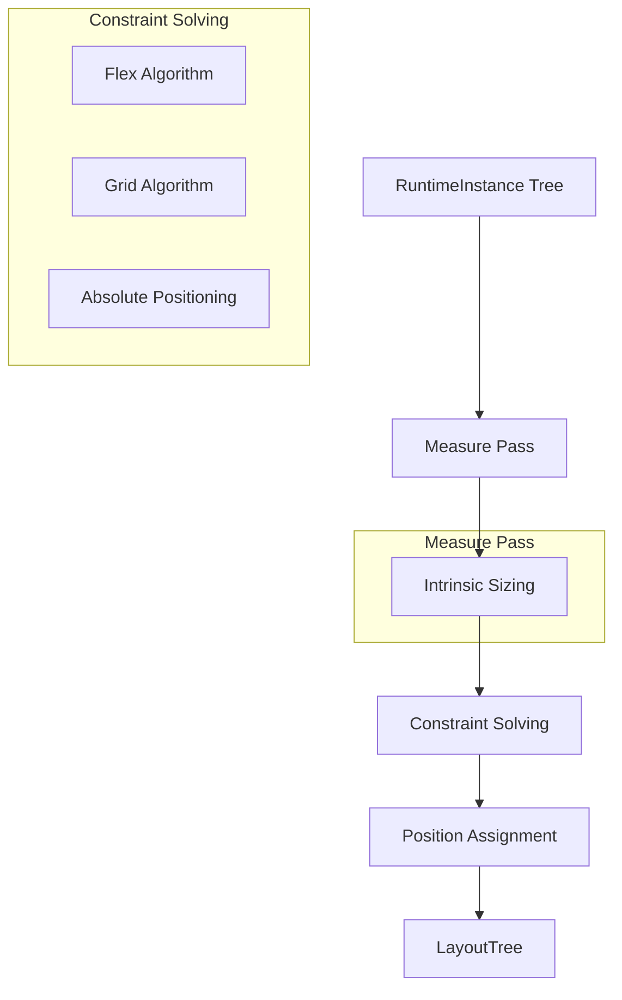

Rezi's layout engine computes cell coordinates for every widget using a constraint-based algorithm with intrinsic sizing. It supports flex, grid, absolute positioning, and responsive layouts.

## Architecture



**Location:** `packages/core/src/layout/layout.ts`

## Intrinsic Sizing Protocol

Every widget implements two measurement functions:

```typescript
interface LayoutKind {
  measureMinContent(node: RuntimeInstance, ctx: MeasureContext): Size;
  measureMaxContent(node: RuntimeInstance, ctx: MeasureContext): Size;
}
```

### Min-Content Size

The smallest size at which the widget can render without overflow:

- **Text:** Width of longest word (no wrapping within words)
- **Button:** Width of label + padding
- **Input:** Minimum viable input width (typically 10 cells)
- **Column:** Max of children's min-content widths
- **Row:** Sum of children's min-content widths + gaps

### Max-Content Size

The ideal size for the widget without external constraints:

- **Text:** Full unwrapped text width
- **Button:** Full label width + padding
- **Input:** Desired width (from props) or max-content of placeholder
- **Column:** Max of children's max-content widths
- **Row:** Sum of children's max-content widths + gaps

**Location:** `packages/core/src/layout/engine/intrinsic.ts`

## Flex Layout Algorithm

Implements a flexbox-style layout for `row` and `column` widgets.

### Stack Layout Properties

```typescript
interface StackProps {
  direction: "horizontal" | "vertical";
  flex?: number;           // Grow factor
  flexShrink?: number;     // Shrink factor (default: 1)
  flexBasis?: number;      // Initial size before growth/shrink
  gap?: number;            // Space between children
  wrap?: boolean;          // Enable wrapping
  align?: "start" | "center" | "end" | "stretch";
  justify?: "start" | "center" | "end" | "space-between" | "space-around";
}
```

### Flex Algorithm Steps

1. **Measure children** — compute min-content and max-content for each child
2. **Resolve flex-basis** — determine initial main-axis size
3. **Distribute space**:
   - If container larger than sum: grow children with `flex > 0`
   - If container smaller than sum: shrink children with `flexShrink > 0`
4. **Align cross-axis** — apply `alignSelf` per child
5. **Handle wrapping** — split into lines if `wrap: true`
6. **Justify main-axis** — distribute remaining space per `justify`

**Location:** `packages/core/src/layout/engine/flex.ts`

### Growth Distribution

When space remains after laying out all children:

```typescript
totalFlex = sum(child.flex for child in children where child.flex > 0)
spacePerFlexUnit = remainingSpace / totalFlex

for each child with flex > 0:
  child.size += child.flex * spacePerFlexUnit
```

### Shrink Distribution

When children exceed available space:

```typescript
totalShrink = sum(child.flexShrink * child.basis for child in children)
shrinkPerUnit = overflowSpace / totalShrink

for each child:
  shrinkAmount = (child.flexShrink * child.basis) * shrinkPerUnit
  child.size = max(child.minContent, child.basis - shrinkAmount)
```

**Location:** `packages/core/src/layout/engine/distributeInteger.ts`

## Grid Layout Algorithm

Implements CSS Grid-style layout with auto-placement and explicit positioning.

### Grid Properties

```typescript
interface GridProps {
  cols?: number;           // Column count
  rows?: number;           // Row count
  gap?: number;            // Gap between cells
  colSizes?: (number | "auto")[]; // Explicit column sizes
  rowSizes?: (number | "auto")[]; // Explicit row sizes
}

interface GridChildProps {
  gridColumn?: number;     // Explicit column index (1-based)
  gridRow?: number;        // Explicit row index (1-based)
  colSpan?: number;        // Column span (default: 1)
  rowSpan?: number;        // Row span (default: 1)
}
```

### Grid Algorithm Steps

1. **Build occupancy map** — track which cells are occupied by explicit placements
2. **Place explicit children** — children with `gridColumn`/`gridRow` set
3. **Auto-place remaining** — find next available cell for each child
4. **Measure tracks**:
   - Fixed tracks: use explicit size
   - Auto tracks: use max-content of cells in track
5. **Distribute space** — grow/shrink tracks to fit container
6. **Position children** — assign final coordinates based on track positions

**Location:** `packages/core/src/layout/kinds/grid.ts`

### Auto-Placement Algorithm

For children without explicit `gridColumn`/`gridRow`:

```typescript
let cursor = { row: 0, col: 0 };

for each child without explicit position:
  while occupancyMap.isOccupied(cursor):
    cursor.col++
    if cursor.col >= colCount:
      cursor.col = 0
      cursor.row++
  
  placeChild(child, cursor)
  markOccupied(cursor, child.colSpan, child.rowSpan)
```

## Box Layout

Box widgets create a synthetic inner column that:
- Honors `box.gap` between children
- Excludes absolute-positioned children from flow
- Applies padding and border

**Location:** `packages/core/src/layout/kinds/box.ts`

## Absolute Positioning

Children with `position: "absolute"` are removed from normal flow:

```typescript
interface AbsoluteProps {
  position: "absolute";
  top?: number;
  right?: number;
  bottom?: number;
  left?: number;
  width?: number;
  height?: number;
}
```

**Rules:**
- Positioned relative to nearest positioned ancestor
- Does not affect siblings' layout
- Computed after all flow layout completes

**Location:** `packages/core/src/layout/positioning.ts`

## Text Wrapping

Text widgets support wrapping with grapheme-aware line breaking:

```typescript
interface TextProps {
  text: string;
  wrap?: boolean;          // Enable wrapping
  width?: number;          // Max width before wrap
}
```

**Algorithm:**
1. Split text into lines on `\n` characters
2. For each line, measure width in terminal cells
3. If width exceeds constraint:
   - Find last grapheme cluster boundary before width
   - Split at boundary (never within a grapheme cluster)
   - Continue with remaining text on next line

**Location:** `packages/core/src/layout/textMeasure.ts`

## Constraint Resolution

The layout engine resolves constraints in multiple passes:

### Pass 1: Measure

Bottom-up measurement:
- Leaf nodes measure their intrinsic size
- Container nodes measure based on children
- Cache measurements to avoid redundant work

### Pass 2: Constrain

Top-down constraint propagation:
- Root receives viewport size as constraint
- Containers distribute constraints to children
- Flex/grid algorithms resolve sizing

### Pass 3: Position

Top-down position assignment:
- Root positioned at `(0, 0)`
- Containers position children based on layout algorithm
- Absolute-positioned children positioned relative to ancestor

**Location:** `packages/core/src/layout/engine/layoutEngine.ts`

## Responsive Layouts

Layout scalars support responsive breakpoints:

```typescript
import { fluid } from "@rezi-ui/core";

ui.box({
  width: fluid({ xs: 20, sm: 40, md: 60, lg: 80 }),
  padding: fluid({ xs: 1, md: 2 })
});
```

**Interpolation:**
- Breakpoints: `xs` (0), `sm` (40), `md` (80), `lg` (120)
- Linear interpolation between breakpoints
- Clamped at edges

**Resolution:**

```typescript
function resolveResponsiveValue<T>(
  value: T | FluidValue<T>,
  viewport: { width: number; height: number }
): T
```

**Location:** `packages/core/src/layout/responsive.ts`

## Overlay Constraints

Overlays (modals, dropdowns, tooltips) have special sizing constraints:

```typescript
interface OverlayConstraints {
  maxWidth?: number;       // Max width relative to viewport
  maxHeight?: number;      // Max height relative to viewport
  anchor?: Rect;           // Anchor element bounds
  placement?: "top" | "bottom" | "left" | "right";
}
```

**Dropdown Geometry:**
- Compute available space in each direction from anchor
- Choose placement with most space
- Constrain size to fit within viewport

**Location:** `packages/core/src/layout/dropdownGeometry.ts`

## Performance Optimizations

### Measurement Caching

Intrinsic measurements are cached per node:

```typescript
interface MeasureCache {
  minContent?: Size;
  maxContent?: Size;
  generation: number;      // Invalidate on prop changes
}
```

**Invalidation:** Cache cleared when node props change

### Dirty Tracking

Only recompute layout for nodes that changed:

```typescript
const dirtySet = computeDirtyLayoutSet(layoutTree, prevLayoutTree);

for (const node of layoutTree) {
  if (dirtySet.has(node.instanceId)) {
    recomputeLayout(node);
  } else {
    reuseLayout(node, prevLayoutTree);
  }
}
```

**Location:** `packages/core/src/layout/engine/dirtySet.ts`

### Integer Distribution

Weighted integer distribution for deterministic flex/grid sizing:

```typescript
function distributeInteger(
  total: number,
  weights: number[]
): number[]
```

**Properties:**
- Sum of results equals `total` exactly
- Deterministic (same inputs → same outputs)
- Proportional to weights

**Location:** `packages/core/src/layout/engine/distributeInteger.ts`

## Layout Tree Output

```typescript
interface LayoutTree {
  root: LayoutNode;
}

interface LayoutNode {
  instanceId: InstanceId;
  x: number;               // Left edge in terminal cells
  y: number;               // Top edge in terminal cells
  width: number;           // Width in terminal cells
  height: number;          // Height in terminal cells
  scrollX: number;         // Scroll offset (if scrollable)
  scrollY: number;
  clipBounds?: Rect;       // Clipping rectangle
  children: LayoutNode[];
}
```

**Coordinates:**
- Origin `(0, 0)` is top-left of viewport
- All measurements in terminal cells (character positions)
- Fractional coordinates not supported (terminal cells are discrete)

## Related Documentation

- [Render Pipeline](/architecture/render-pipeline) — How layout fits in the pipeline
- [Protocol Overview](/architecture/protocol/overview) — Binary format for rendering
- [Benchmarks](/architecture/benchmarks) — Layout performance measurements
