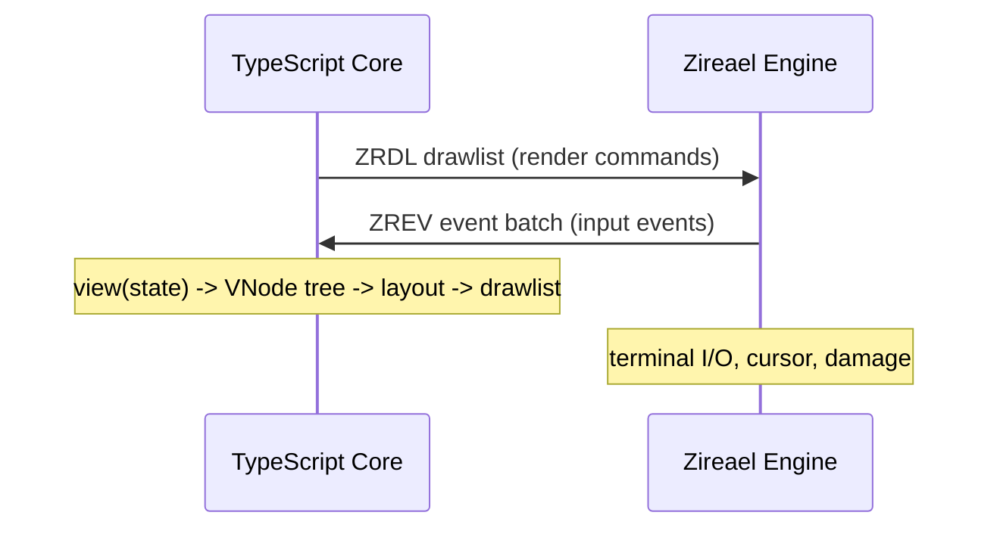

Rezi communicates between its TypeScript core and the Zireael C engine through two binary formats: **ZRDL** (drawlists) and **ZREV** (event batches). Both formats cross a strict ABI boundary with versioned, validated protocols.

## Data Flow



The core's rendering pipeline produces a ZRDL binary every frame. The engine parses that binary, executes the draw commands against the terminal, and sends back input events as ZREV batches.

## Binary Format Principles

All Rezi binary formats share the following properties:

- **Little-endian byte order.** All multi-byte integers are stored least-significant byte first.
- **4-byte alignment.** All section offsets, section sizes, and the total buffer size are 4-byte aligned. Padding bytes are explicitly zeroed.
- **Versioned.** Each format begins with a magic number and version field. The engine rejects unknown versions.
- **Validated strictly.** Both the builder (TypeScript side) and the engine (C side) validate the buffer independently. Malformed input is never silently accepted.

## Format Summary

| Format | Magic bytes | Description | Direction |
|--------|-------------|-------------|-----------||
| **ZRDL** | `0x4C44525A` (`ZRDL`) | Drawlist: rendering commands, strings, blobs | Core → Engine |
| **ZREV** | `0x5645525A` (`ZREV`) | Event batch: keyboard/mouse/resize events | Engine → Core |

Both magic values are encoded as little-endian `u32` constants.

### Magic Bytes

```typescript
import { ZRDL_MAGIC, ZREV_MAGIC } from "@rezi-ui/core";

// ZRDL_MAGIC = 0x4C44525A ("ZRDL" as LE u32)
// ZREV_MAGIC = 0x5645525A ("ZREV" as LE u32)
```

## ZRDL Drawlists

**Purpose:** Encode rendering commands from TypeScript to native engine

**Structure:**
- 64-byte header with section offsets
- Command stream (fixed-size command records)
- String span table + byte pool
- Blob span table + byte pool

**Commands:**
- `OP_CLEAR` — clear framebuffer
- `OP_FILL_RECT` — fill rectangle with style
- `OP_DRAW_TEXT` — draw UTF-8 string
- `OP_PUSH_CLIP` / `OP_POP_CLIP` — clipping regions
- `OP_SET_CURSOR` — terminal cursor control (v2+)
- `OP_DRAW_TEXT_RUN` — multi-segment styled text
- `OP_DRAW_CANVAS` — canvas rendering (v4+)
- `OP_DRAW_IMAGE` — image rendering (v5+)

**See:** [ZRDL Drawlists](/architecture/protocol/zrdl)

## ZREV Event Batches

**Purpose:** Encode input events from native engine to TypeScript

**Structure:**
- 24-byte header with version and record count
- Self-framed event records (variable length)

**Event types:**
- **Key** — keyboard input with key code and modifiers
- **Mouse** — mouse events (move, drag, down, up, wheel)
- **Resize** — terminal size change
- **Tick** — animation frame timer

**See:** [ZREV Event Batches](/architecture/protocol/zrev)

## Versioning Strategy

Rezi uses explicit version pins at every binary boundary.

### Engine ABI Version

Tracks the C engine's public API surface:

```typescript
import {
  ZR_ENGINE_ABI_MAJOR,  // 1
  ZR_ENGINE_ABI_MINOR,  // 2
  ZR_ENGINE_ABI_PATCH,  // 0
} from "@rezi-ui/core";
```

**Current version:** `1.2.0`

**Compatibility rules:**
- Major mismatch → incompatible
- Minor mismatch → backward compatible if `core.minor <= engine.minor`
- Patch mismatch → always compatible

### Drawlist Format Versions

```typescript
import {
  ZR_DRAWLIST_VERSION_V1,  // 1
  ZR_DRAWLIST_VERSION_V2,  // 2
  ZR_DRAWLIST_VERSION_V3,  // 3
  ZR_DRAWLIST_VERSION_V4,  // 4
  ZR_DRAWLIST_VERSION_V5,  // 5
} from "@rezi-ui/core";
```

**Version history:**
- **v1:** Base format (CLEAR, FILL_RECT, DRAW_TEXT, PUSH_CLIP, POP_CLIP, DRAW_TEXT_RUN)
- **v2:** Adds SET_CURSOR for native cursor control
- **v3:** Extends style payloads (underline style/color + hyperlink refs)
- **v4:** Adds DRAW_CANVAS
- **v5:** Adds DRAW_IMAGE

### Event Batch Version

```typescript
import { ZR_EVENT_BATCH_VERSION_V1 } from "@rezi-ui/core";
```

**Current version:** `1`

**See:** [Protocol Versioning](/architecture/protocol/versioning)

## Unicode Version Pin

Rezi pins Unicode 15.1.0 for deterministic text measurement:

```typescript
import {
  ZR_UNICODE_VERSION_MAJOR,  // 15
  ZR_UNICODE_VERSION_MINOR,  // 1
  ZR_UNICODE_VERSION_PATCH,  // 0
} from "@rezi-ui/core";
```

Both TypeScript core and C engine use tables derived from this version. A version mismatch would cause layout drift—widgets would measure strings differently than the engine renders them.

## Validation Flow

### Builder Side (TypeScript)

1. Builder writes correct magic and version into header
2. Builder validates all commands before writing
3. Builder enforces resource caps (strings, blobs, total bytes)
4. `build()` returns `{ ok: true, bytes }` or `{ ok: false, error }`

### Engine Side (C)

1. Read magic at offset 0. Reject with `ERR_FORMAT` if mismatch
2. Read version at offset 4. Reject with `ERR_UNSUPPORTED` if unknown
3. Validate header size at offset 8. Reject if wrong
4. Process commands. Reject unknown opcodes with `ERR_UNSUPPORTED`
5. Validate section offsets and alignment
6. Execute commands against framebuffer

## Safety Guarantees

All binary protocols enforce:

1. **Validate before read.** Every field is bounds-checked before access
2. **Cap enforcement.** All resource pools have configurable upper bounds
3. **Structured error returns.** Parsers never throw into user code
4. **Alignment invariants.** All offsets/sizes are 4-byte aligned
5. **Deterministic failure.** Same invalid input → same error

**See:** [Safety Rules](/architecture/protocol/safety)

## ABI Constants

All version constants and magic bytes are exported from `@rezi-ui/core`:

```typescript
import {
  // Engine ABI
  ZR_ENGINE_ABI_MAJOR,
  ZR_ENGINE_ABI_MINOR,
  ZR_ENGINE_ABI_PATCH,

  // Drawlist format
  ZR_DRAWLIST_VERSION_V1,
  ZR_DRAWLIST_VERSION_V2,
  ZR_DRAWLIST_VERSION_V3,
  ZR_DRAWLIST_VERSION_V4,
  ZR_DRAWLIST_VERSION_V5,

  // Event batch format
  ZR_EVENT_BATCH_VERSION_V1,

  // Unicode
  ZR_UNICODE_VERSION_MAJOR,
  ZR_UNICODE_VERSION_MINOR,
  ZR_UNICODE_VERSION_PATCH,

  // Magic bytes
  ZRDL_MAGIC,
  ZREV_MAGIC,

  // Cursor shapes
  ZR_CURSOR_SHAPE_BLOCK,
  ZR_CURSOR_SHAPE_UNDERLINE,
  ZR_CURSOR_SHAPE_BAR,
} from "@rezi-ui/core";
```

**See:** [ABI Pins](/architecture/protocol/abi)

## Related Documentation

- [ZRDL Drawlists](/architecture/protocol/zrdl) — Rendering command format
- [ZREV Event Batches](/architecture/protocol/zrev) — Input event format
- [Versioning](/architecture/protocol/versioning) — Version compatibility rules
- [Safety Rules](/architecture/protocol/safety) — Validation patterns
- [ABI Pins](/architecture/protocol/abi) — Constant reference table
