The Rezi render pipeline transforms application state into terminal output through a series of well-defined phases. Each phase has specific responsibilities and invariants.

## Pipeline Phases

```mermaid
flowchart LR
  State[State Update] --> View[view function]
  View --> VNode[VNode Tree]
  VNode --> Commit[Commit/Reconcile]
  Commit --> Layout[Layout Engine]
  Layout --> Metadata[Metadata Collection]
  Metadata --> Overlay[Overlay Manager]
  Overlay --> Render[Render to Drawlist]
  Render --> Build[Builder Build]
  Build --> Backend[Backend Submit]
  Backend --> Present[Engine Present]
```



### Phase 1: State → View

**Input:** Application state object  
**Output:** VNode tree  
**Location:** `packages/core/src/app/widgetRenderer.ts`

The application's `view(state)` function is called to produce a declarative VNode tree. This function must be pure—no side effects, no mutations.

```typescript
function view(state: State): VNode {
  return ui.column([
    ui.text(`Counter: ${state.count}`),
    ui.button({ id: "inc", label: "Increment" })
  ]);
}
```

### Phase 2: VNode Tree → Commit

**Input:** VNode tree  
**Output:** RuntimeInstance tree  
**Location:** `packages/core/src/runtime/commit.ts`

The commit phase reconciles the new VNode tree against the previous committed tree:

1. **Allocate instance IDs** for new nodes
2. **Validate uniqueness** of interactive widget IDs
3. **Match children** using keys (keyed) or position (unkeyed)
4. **Track lifecycle** — mounted, reused, unmounted instances
5. **Clean up** local state for unmounted instances

**Reconciliation Algorithm:**

For children without explicit keys:
- Match by position if widget kinds are compatible
- Reuse existing RuntimeInstance when possible
- Create new instances for additions
- Unmount instances for removals

For children with explicit keys (via `key` prop):
- Build lookup map of previous children by key
- Match new children to previous children by key
- Reuse when key matches
- Fatal error if duplicate keys detected

**Location:** `packages/core/src/runtime/reconcile.ts`

### Phase 3: Layout Computation

**Input:** RuntimeInstance tree + viewport size  
**Output:** LayoutTree with cell coordinates  
**Location:** `packages/core/src/layout/layout.ts`

The layout engine computes cell coordinates for every widget:

1. **Measure pass** — compute intrinsic sizes via `measureMinContent` / `measureMaxContent`
2. **Constraint solving** — resolve flex, grid, and absolute positioning
3. **Position assignment** — assign final `(x, y, width, height)` to each node
4. **Overflow detection** — track scroll regions and clipping bounds

**Key algorithms:**
- Stack flex layout (`packages/core/src/layout/engine/flex.ts`)
- Grid layout with auto-placement (`packages/core/src/layout/kinds/grid.ts`)
- Intrinsic sizing protocol (`packages/core/src/layout/engine/intrinsic.ts`)
- Absolute positioning (`packages/core/src/layout/positioning.ts`)

### Phase 4: Metadata Collection

**Input:** LayoutTree  
**Output:** Focus metadata, scroll targets, overlay geometry  

Collects widget-specific metadata:
- **Focusable widgets** — IDs and bounding boxes for focus traversal
- **Scroll targets** — regions with `overflow: "scroll"`
- **Dropdown geometry** — overlay positioning constraints

**Location:** `packages/core/src/runtime/focus.ts`

### Phase 5: Overlay Manager (LayerRegistry)

**Input:** Metadata from overlays (modals, dropdowns, tooltips)  
**Output:** Resolved z-order and clipping  
**Location:** `packages/core/src/layout/dropdownGeometry.ts`

Manages overlays with proper stacking:
- Computes dropdown positioning relative to anchors
- Resolves z-order for modals and command palettes
- Applies overlay sizing constraints

### Phase 6: Render to Drawlist

**Input:** LayoutTree  
**Output:** ZRDL binary drawlist  
**Location:** `packages/core/src/renderer/renderToDrawlist/renderTree.ts`

Stack-based depth-first traversal that emits rendering commands:

```typescript
// Simplified render loop
for (const node of dfsTraversal(layoutTree)) {
  if (node.kind === "box") {
    builder.pushClip(node.x, node.y, node.width, node.height);
    builder.fillRect(node.x, node.y, node.width, node.height, node.style);
  } else if (node.kind === "text") {
    builder.drawText(node.x, node.y, node.text, node.style);
  }
}
```

**Commands emitted:**
- `OP_CLEAR` — clear framebuffer
- `OP_FILL_RECT` — fill rectangle with style
- `OP_DRAW_TEXT` — draw string at position
- `OP_PUSH_CLIP` / `OP_POP_CLIP` — manage clipping regions
- `OP_SET_CURSOR` — position terminal cursor
- `OP_DRAW_TEXT_RUN` — multi-segment styled text

### Phase 7: Builder Build

**Input:** Accumulated commands in builder  
**Output:** `Uint8Array` containing ZRDL binary  
**Location:** `packages/core/src/drawlist/builder_v1.ts`

The builder finalizes the drawlist:
1. Write 64-byte header with section offsets
2. Write command stream
3. Write string span table and byte pool
4. Write blob span table and byte pool
5. Validate alignment and caps

### Phase 8: Backend Submit

**Input:** ZRDL binary  
**Output:** Transfer to worker thread (or inline submission)  
**Location:** `packages/node/src/backend/nodeBackend.ts`

Depends on execution mode:
- **Worker mode:** Transfer buffer to worker thread via `postMessage`
- **Inline mode:** Submit directly to engine on main thread
- **SAB mode:** Write to SharedArrayBuffer mailbox slot

### Phase 9: Engine Present

**Input:** ZRDL binary  
**Output:** ANSI bytes written to terminal  
**Engine:** Zireael C engine

The engine:
1. Validates ZRDL header and version
2. Parses commands into internal command buffer
3. Executes commands against next framebuffer
4. Diffs previous vs. next framebuffer
5. Emits minimal ANSI escape sequences
6. Writes single ANSI chunk to terminal

## Reconciliation Details

### Keyed Reconciliation

When children have explicit `key` props:

```typescript
ui.column([
  each(items, (item) => 
    ui.text({ key: item.id, text: item.name })
  )
]);
```

Reconciliation:
1. Build map: `prevChildrenByKey = new Map([[key, instance], ...])`
2. For each new child:
   - Look up `prevChildrenByKey.get(newChild.key)`
   - Reuse instance if found
   - Create new instance if not found
3. Unmount instances with keys not in new children

**Fatal errors:**
- Duplicate keys in new children → `ZRUI_DUPLICATE_KEY`
- Duplicate widget IDs across tree → `ZRUI_DUPLICATE_ID`

### Unkeyed Reconciliation

When children lack explicit keys, match by position:

```typescript
ui.column([
  ui.text("Line 1"),
  ui.text("Line 2"),
]);
```

1. Match `newChildren[i]` with `prevChildren[i]`
2. Reuse if widget kinds are compatible
3. Create new instance if kind changed
4. Unmount trailing previous children if new array is shorter
5. Mount new children if new array is longer

## Optimization Strategies

### String Interning

Within a single drawlist, identical strings are stored once in the string table. All `OP_DRAW_TEXT` commands reference the same string index.

**Benefit:** Reduces drawlist size for repeated strings (labels, headers, etc.)

### Encoded String Cache

Optional cache for UTF-8 encoded strings across frames:

```typescript
const builder = createDrawlistBuilderV2({
  encodedStringCacheCap: 1024 // Enable cache
});
```

**Benefit:** Avoids redundant `TextEncoder.encode()` calls for stable strings

**Trade-off:** Memory overhead; disabled by default

### Dirty Tracking

The layout engine tracks which nodes changed since the last frame:

```typescript
const dirtySet = computeDirtyLayoutSet(layoutTree, prevLayoutTree);
```

**Benefit:** Skip rendering unchanged subtrees (future optimization)

### Incremental Layout (Experimental)

Layout engine supports partial layout updates for localized changes:

- Only recompute layout for dirty subtrees
- Reuse layout results for clean subtrees

**Status:** Available but not enabled by default

## Performance Characteristics

| Phase | Typical Time (1000-node tree) | Notes |
|-------|-------------------------------|-------|
| Commit | ~500 µs | Dominated by reconciliation |
| Layout | ~800 µs | Depends on constraint complexity |
| Render | ~400 µs | String interning helps |
| Build | ~100 µs | Binary writing is fast |
| Engine | ~200 µs | Native C diff rendering |

**Total:** ~2 ms for typical 1000-node tree

## Related Documentation

- [Layout Engine](/architecture/layout-engine) — Constraint solving algorithms
- [Event System](/architecture/event-system) — Event routing back to widgets
- [ZRDL Protocol](/architecture/protocol/zrdl) — Binary drawlist format
- [Determinism](/architecture/determinism) — Reproducibility guarantees
