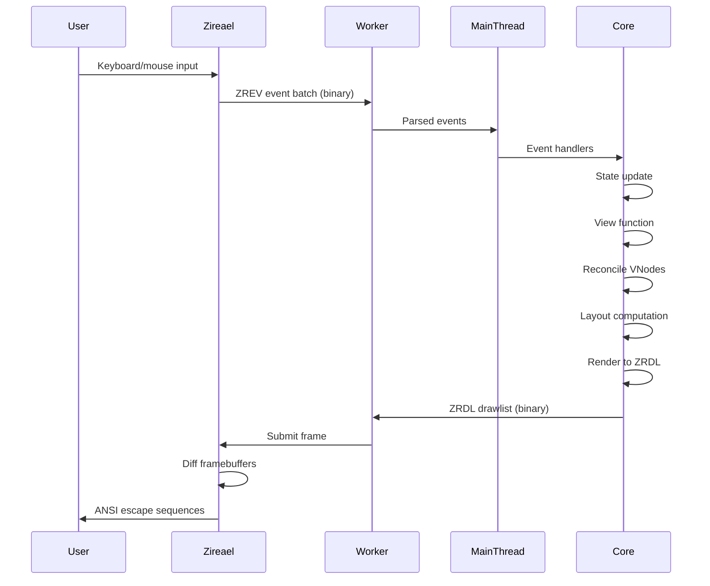

Rezi is a **layered system** with strict boundaries between runtime-agnostic UI logic, Node.js integration, and native terminal rendering.

## Layer Responsibilities

<Accordion title="@rezi-ui/core — Runtime-Agnostic Core">
  **Owns:**
  - Widget tree reconciliation and diffing
  - Layout engine (flexbox-inspired model)
  - Theme system and design tokens
  - Keybindings and focus management
  - Form state and validation
  - Binary protocol encoding/decoding
  
  **Does NOT own:**
  - Terminal I/O or system calls
  - Worker threads or async primitives
  - File system access
  
  **Key constraint:** No Node.js-specific APIs (`Buffer`, `worker_threads`, `node:*` imports)
  
  This layer could theoretically run in any JavaScript runtime (Deno, Bun, browser with WebAssembly).
</Accordion>

<Accordion title="@rezi-ui/node — Node.js Backend">
  **Owns:**
  - Worker thread lifecycle management
  - Frame scheduling and event loop integration
  - Buffer transport between main and worker threads
  - Execution mode selection (`inline` vs `worker`)
  
  **Does NOT own:**
  - Widget definitions or layout math
  - Protocol semantics (delegated to core)
  
  **API:** `createNodeApp({ initialState, config, theme })`
</Accordion>

<Accordion title="@rezi-ui/native — N-API Addon">
  **Owns:**
  - N-API bindings to Zireael engine
  - Engine lifecycle (start/stop/dispose)
  - SharedArrayBuffer interop for zero-copy event batches
  
  **Does NOT own:**
  - Protocol versioning (enforced by core)
  - Terminal capability detection (provided by engine)
</Accordion>

<Accordion title="Zireael (C Engine)">
  **Owns:**
  - Terminal I/O (raw mode, alternate screen)
  - Framebuffer management
  - Diff rendering (minimize ANSI output)
  - Platform-specific escape sequence handling
  - Input event parsing (kitty protocol, CSI-u, legacy)
  
  **Does NOT own:**
  - Widget definitions
  - Layout calculations
  - Theme semantics
</Accordion>

## Data Flow

A single frame follows this path through the system:



### Phase Breakdown

<Steps>
  <Step title="Event Dispatch">
    Terminal input → Zireael parses raw bytes → ZREV event batch → worker thread → main thread → app event handlers
  </Step>
  
  <Step title="State Update">
    Event handler calls `app.update()` → state transitions queued → batched into single commit at next commit point
  </Step>
  
  <Step title="View">
    `view(state)` called → VNode tree produced
  </Step>
  
  <Step title="Reconciliation">
    New tree diffed against previous tree using keys and structural matching
  </Step>
  
  <Step title="Layout">
    Widget sizes and positions computed (cell coordinates)
  </Step>
  
  <Step title="Render">
    Layout tree walked to produce draw commands
  </Step>
  
  <Step title="Drawlist Encoding">
    Commands encoded into ZRDL binary format
  </Step>
  
  <Step title="Present">
    Drawlist transferred to worker → worker submits to Zireael → Zireael diffs prev/next framebuffers → emits minimal ANSI bytes → single write to terminal
  </Step>
</Steps>

## Binary Protocol Boundary

The native engine communicates exclusively through two **versioned binary formats**:

### ZRDL (Drawlists)

Rendering commands flowing **down** from TypeScript to the engine.

**Structure:**
- 64-byte header (`magic: "ZRDL"` / `0x4C44525A` as little-endian u32)
- Command records (clear, fill_rect, draw_text, push_clip, pop_clip, set_cursor)
- String table (UTF-8 encoded text)
- Optional blob table (binary data)

**Versions:** v1 (legacy), v2, v3, v4, v5 (current)

**Why binary?**
- **Performance**: Zero-copy transfer via SharedArrayBuffer
- **Determinism**: Byte-level reproducibility for testing
- **Versioning**: Strict validation prevents silent corruption

### ZREV (Event Batches)

Input events flowing **up** from the engine to TypeScript.

**Structure:**
- 24-byte header (`magic: "ZREV"` / `0x5645525A` as little-endian u32)
- Self-framed event records:
  - `key`: Keyboard events (key code, modifiers, action)
  - `text`: Text input (UTF-8 codepoints)
  - `paste`: Bracketed paste mode
  - `mouse`: Mouse events (position, button, modifiers)
  - `resize`: Terminal size changes
  - `tick`: Frame timing events
  - `user`: Custom user events

**Why binary?**
- **Batching**: Multiple events per poll reduces syscall overhead
- **Timestamping**: Precise event timing for animations
- **Overflow handling**: Graceful degradation under input floods

## Execution Modes

The Node/Bun backend supports three execution modes:

<Tabs>
  <Tab title="auto (default)">
    Selects `inline` when `fpsCap <= 30`, otherwise `worker`.
    
    **Best for:** Most applications (balances latency and throughput)
  </Tab>
  
  <Tab title="worker">
    Native engine runs on a **dedicated worker thread**. Main thread is never blocked by terminal I/O.
    
    **Best for:** High-FPS apps (60 FPS), background processing, long-running operations
    
    **Trade-offs:** Adds ~1-2ms latency due to thread communication
  </Tab>
  
  <Tab title="inline">
    Engine runs on the **main thread**. Lowest latency, but main thread blocks during I/O.
    
    **Best for:** Low-FPS apps (30 FPS or less), minimal latency requirements
    
    **Trade-offs:** State updates during terminal I/O may stall
  </Tab>
</Tabs>

```typescript
import { createNodeApp } from '@rezi-ui/node';

const app = createNodeApp({
  initialState: {},
  config: {
    fpsCap: 60,
    // mode: 'worker' is auto-selected for 60 FPS
  },
});
```

## Widget Protocol Registry

Widget capability detection is centralized in `packages/core/src/widgets/protocol.ts`.

The render/runtime pipeline uses **protocol lookups** instead of hardcoded widget-kind checks:

```typescript
import { canAcceptFocus, isInteractive } from '@rezi-ui/core';

// Check if a widget can receive focus
if (canAcceptFocus(vnode.kind)) {
  // Handle Tab navigation
}

// Check if a widget handles user input
if (isInteractive(vnode.kind)) {
  // Route mouse/keyboard events
}
```

**Benefits:**
- Consistent behavior across commit, focus, hit-testing, and routing
- Easy to extend with new widget kinds
- No scattered conditionals

## Design Constraints

### No Node.js APIs in Core

`@rezi-ui/core` must remain **runtime-agnostic**. It contains no `Buffer`, `worker_threads`, `fs`, or `node:*` imports.

**Why?** Enables future portability to Deno, Bun, or WebAssembly runtimes.

**Enforced by:** CI checks and package.json constraints

### Binary Boundary for Safety

All data crossing the native boundary goes through **versioned binary formats** with strict validation.

**No raw pointers or shared mutable state** cross the TypeScript/C boundary.

**Why?**
- Prevents memory corruption
- Enables protocol evolution
- Supports deterministic rendering

### Deterministic Rendering

Same initial state + same event sequence = **same frames**.

**Achieved through:**
- Pinned Unicode tables (v15.1.0)
- Versioned protocols
- Strict commit-point semantics
- Update batching and coalescing

**Why?** Enables reproducible testing, replay debugging, and visual regression testing.

### No Per-Frame Heap Churn

The engine pre-allocates framebuffers, output buffers, and event queues at creation time.

The diff renderer operates on **caller-provided buffers** with no dynamic allocation.

**Why?** Maintains consistent 60 FPS without GC pauses.

### Single Flush Per Present

`engine_present()` writes **exactly one chunk** to the terminal on success, zero on failure.

**No partial ANSI sequences** reach the terminal.

**Why?** Prevents visual tearing and cursor flicker.

## Pipeline Performance

Typical frame timings at 60 FPS (16.6ms budget):

| Phase | Time | Notes |
|-------|------|-------|
| Event parse | ~0.1ms | Binary format enables fast parsing |
| State commit | ~0.5ms | Pure function application |
| View function | 0.5-2ms | User code (depends on complexity) |
| Reconciliation | 0.5-1ms | Keyed diffing with early bailouts |
| Layout | 1-3ms | Flexbox-inspired constraint solving |
| Render | 0.5-1ms | Tree walk to draw commands |
| Drawlist build | 0.5-1ms | Binary encoding |
| Diff + ANSI | 1-2ms | Native C engine |
| **Total** | **5-11ms** | Leaves 5-11ms headroom |

<Info>
  **Optimization tip:** Use `fpsCap: 30` for most apps. 60 FPS is rarely necessary for TUIs and uses 2x CPU.
</Info>

## Related Documentation

<CardGroup cols={2}>
  <Card title="Widgets" icon="cube" href="/concepts/widgets">
    Learn about VNodes and the widget system
  </Card>
  <Card title="Lifecycle" icon="rotate" href="/concepts/lifecycle">
    Understand app startup and shutdown
  </Card>
  <Card title="Protocol: ZRDL" icon="file-code" href="/architecture/protocol/zrdl">
    Drawlist format specification
  </Card>
  <Card title="Protocol: ZREV" icon="keyboard" href="/architecture/protocol/zrev">
    Event batch format specification
  </Card>
</CardGroup>