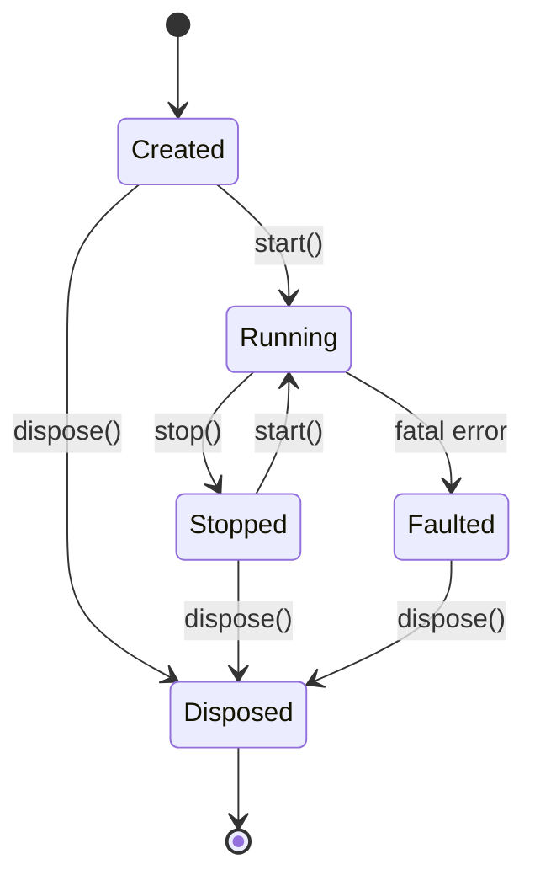

Rezi applications follow a well-defined lifecycle from creation to disposal. Understanding this lifecycle is crucial for proper resource management and graceful shutdown.

## Application Creation

Create an app with `createNodeApp()` (for Node.js/Bun):

```typescript
import { createNodeApp } from '@rezi-ui/node';
import { ui } from '@rezi-ui/core';

type State = { count: number };

const app = createNodeApp<State>({
  initialState: { count: 0 },
  config: {
    fpsCap: 30,              // Frame rate cap (default: 60)
    maxEventBytes: 1048576,  // Event buffer size (default: 1 MiB)
    rootPadding: 1,          // Padding around root widget
  },
  theme: myTheme,            // Optional custom theme
});
```

### Configuration Options

<ParamField path="initialState" type="S" required>
  Initial application state. Must be a plain object.
</ParamField>

<ParamField path="config.fpsCap" type="number" default="60">
  Maximum frame rate (1-1000). Most TUIs work well at 30 FPS.
</ParamField>

<ParamField path="config.maxEventBytes" type="number" default="1048576">
  Event buffer size in bytes. Must match backend if using custom backends.
</ParamField>

<ParamField path="config.rootPadding" type="number" default="0">
  Padding (in cells) around the root widget.
</ParamField>

<ParamField path="config.maxFramesInFlight" type="number" default="1">
  Maximum concurrent frames allowed (1-4). Higher values improve throughput but increase latency.
</ParamField>

<ParamField path="config.themeTransitionFrames" type="number" default="0">
  Number of frames to animate theme transitions. Set to 10-20 for smooth color changes.
</ParamField>

<ParamField path="theme" type="Theme | ThemeDefinition">
  Custom theme. Defaults to `defaultTheme`.
</ParamField>

## Defining the View

Attach a view function that transforms state to VNodes:

```typescript
app.view((state: State) => 
  ui.page({ p: 1 }, [
    ui.text(`Count: ${state.count}`),
    ui.button({
      id: 'increment',
      label: '+1',
      onPress: () => app.update(s => ({ count: s.count + 1 }))
    }),
  ])
);
```

<Info>
  `app.view()` must be called **before** `app.start()` and can only be called once (or use `app.replaceView()` to swap views at runtime).
</Info>

### View Function Requirements

1. **Pure function**: Same state → same VNode tree
2. **No side effects**: No API calls, timers, or I/O
3. **Returns VNode**: Must return a valid VNode (not `null` or `undefined`)

```typescript
// ✅ GOOD: Pure view
app.view(state => ui.text(`Count: ${state.count}`));

// ❌ BAD: Side effects in view
app.view(state => {
  console.log('Rendering...');  // Side effect
  fetchData();                   // Side effect
  return ui.text(`Count: ${state.count}`);
});
```

Side effects belong in:
- Event handlers (`onPress`, `onInput`, etc.)
- Keybinding callbacks
- `useEffect` hooks inside `defineWidget`

## Starting the App

### app.start()

Start the app without signal handling:

```typescript
await app.start();
console.log('App is running');

// Manually stop later
await app.stop();
app.dispose();
```

### app.run()

Start the app with **automatic signal handling** (recommended):

```typescript
await app.run();
// Automatically handles SIGINT, SIGTERM, SIGHUP
// Returns when app stops
```

`app.run()` is equivalent to:

```typescript
const signals = ['SIGINT', 'SIGTERM', 'SIGHUP'];

for (const signal of signals) {
  process.on(signal, async () => {
    await app.stop();
    app.dispose();
    process.exit(0);
  });
}

await app.start();
```

<Warning>
  Always call `app.dispose()` after stopping to release native resources. Failing to dispose can leak memory and file descriptors.
</Warning>

## State Management

### app.update()

Update application state:

```typescript
// Functional update (recommended)
app.update(prev => ({ ...prev, count: prev.count + 1 }));

// Direct replacement
app.update({ count: 0 });
```

**Update batching:** Multiple `update()` calls in the same event loop tick are **coalesced** into a single render:

```typescript
app.update(s => ({ ...s, count: s.count + 1 }));
app.update(s => ({ ...s, name: 'Alice' }));
app.update(s => ({ ...s, email: 'alice@example.com' }));
// Only 1 render happens, not 3
```

### Reducer Pattern (Recommended)

For non-trivial apps, use a **reducer pattern**:

```typescript
// types.ts
type State = { count: number; items: string[] };
type Action =
  | { type: 'increment' }
  | { type: 'addItem'; text: string }
  | { type: 'removeItem'; index: number };

// state.ts
function reduce(state: State, action: Action): State {
  switch (action.type) {
    case 'increment':
      return { ...state, count: state.count + 1 };
    case 'addItem':
      return { ...state, items: [...state.items, action.text] };
    case 'removeItem':
      return { ...state, items: state.items.filter((_, i) => i !== action.index) };
  }
}

// main.ts
function dispatch(action: Action) {
  app.update(s => reduce(s, action));
}

app.keys({
  '+': () => dispatch({ type: 'increment' }),
  'a': () => dispatch({ type: 'addItem', text: 'New item' }),
});
```

**Benefits:**
- Pure, testable state logic
- Type-safe actions
- Centralized state transitions
- Easy to debug (log actions)

### State Invariants

<Warning>
  **Never mutate state directly:**
  
  ```typescript
  // ❌ BAD: Mutation
  app.update(s => {
    s.count++;  // Mutates state!
    return s;
  });
  
  // ✅ GOOD: Immutable update
  app.update(s => ({ ...s, count: s.count + 1 }));
  ```
  
  Mutating state breaks reconciliation and causes stale renders.
</Warning>

<Warning>
  **Cannot call `app.update()` during render:**
  
  ```typescript
  // ❌ BAD: Update during render
  app.view(state => {
    app.update({ count: 5 });  // ERROR: ZRUI_UPDATE_DURING_RENDER
    return ui.text('...');
  });
  ```
  
  Move state updates to event handlers or `useEffect`.
</Warning>

## Keybindings

### app.keys()

Register global keybindings:

```typescript
app.keys({
  'q': () => app.stop(),
  'ctrl+c': () => app.stop(),
  'ctrl+s': () => saveData(),
  '+': () => app.update(s => ({ ...s, count: s.count + 1 })),
  '-': () => app.update(s => ({ ...s, count: s.count - 1 })),
});
```

**Chord sequences** (Vim-style):

```typescript
app.keys({
  'g g': () => scrollToTop(),      // Press 'g' twice
  'g G': () => scrollToBottom(),   // Press 'g' then 'G'
});
```

**Modifier keys:**

```typescript
app.keys({
  'ctrl+k': () => deleteForward(),
  'alt+b': () => backwardWord(),
  'shift+tab': () => focusPrevious(),
  'meta+q': () => app.stop(),  // Cmd on Mac, Win on Windows
});
```

### app.modes()

Modal keybinding modes (like Vim):

```typescript
app.modes({
  normal: {
    'i': () => app.setMode('insert'),
    'j': () => moveCursorDown(),
    'k': () => moveCursorUp(),
    '/': () => app.setMode('search'),
  },
  insert: {
    'escape': () => app.setMode('normal'),
  },
  search: {
    'escape': () => app.setMode('normal'),
    'enter': () => executeSearch(),
  },
});
```

**Mode switching:**

```typescript
app.setMode('normal');     // Switch to normal mode
app.getMode();             // Get current mode
```

## Event Handling

### app.onEvent()

Listen to all application events:

```typescript
const removeListener = app.onEvent(event => {
  if (event.kind === 'action') {
    console.log('Action:', event);
  }
  
  if (event.kind === 'engine') {
    console.log('Engine event:', event.event);
  }
  
  if (event.kind === 'fatal') {
    console.error('Fatal error:', event.code, event.detail);
  }
});

// Cleanup
removeListener();
```

**Event types:**

<CodeGroup>
```typescript Action Events
{
  kind: 'action',
  type: 'press' | 'input' | 'toggle' | 'select' | 'change' | 'scroll',
  id: string,
  // ... type-specific fields
}
```

```typescript Engine Events
{
  kind: 'engine',
  event: {
    kind: 'key' | 'text' | 'paste' | 'mouse' | 'resize' | 'tick',
    // ... event-specific fields
  }
}
```

```typescript Fatal Errors
{
  kind: 'fatal',
  code: ZrUiErrorCode,
  detail: string,
}
```
</CodeGroup>

### app.onFocusChange()

Track focus changes:

```typescript
app.onFocusChange(focusInfo => {
  console.log('Focused widget:', focusInfo.id);
  console.log('Focus metadata:', focusInfo.metadata);
});
```

## Theme Management

### app.setTheme()

Dynamically change the theme:

```typescript
import { darkTheme, lightTheme } from './themes';

let isDark = false;

app.keys({
  't': () => {
    isDark = !isDark;
    app.setTheme(isDark ? darkTheme : lightTheme);
  },
});
```

With **animated transitions**:

```typescript
const app = createNodeApp({
  initialState: {},
  config: {
    themeTransitionFrames: 15,  // Animate over 15 frames
  },
});

app.setTheme(newTheme);  // Smoothly interpolates colors
```

## Stopping and Cleanup

### app.stop()

Gracefully stop the application:

```typescript
await app.stop();
// Terminal is restored to normal mode
// No new frames will be rendered
```

### app.dispose()

Release all native resources:

```typescript
app.dispose();
// Backend is disposed
// Native engine is freed
// Cannot restart after disposal
```

**Proper shutdown sequence:**

```typescript
try {
  await app.stop();
} finally {
  app.dispose();
}
```

## State Machine

The app follows this state machine:



**State transitions:**

- **Created**: App initialized, ready for `start()`
- **Running**: Event loop active, rendering frames
- **Stopped**: Gracefully stopped, can restart
- **Faulted**: Unrecoverable error, must dispose
- **Disposed**: Resources released, cannot restart

<Warning>
  Once **Disposed** or **Faulted**, the app cannot be restarted. Create a new app instance instead.
</Warning>

## Error Handling

### Top-Level View Errors

If the view function throws, Rezi displays an **error screen** with retry/quit options:

```typescript
app.view(state => {
  if (state.data === null) {
    throw new Error('Data not loaded');  // Caught by Rezi
  }
  return ui.text(state.data);
});
```

Press **R** to retry, **Q** to quit.

### Fatal Errors

Fatal errors transition the app to **Faulted** state:

```typescript
app.onEvent(event => {
  if (event.kind === 'fatal') {
    console.error('Fatal:', event.code, event.detail);
    
    // App is now Faulted
    // Backend is automatically stopped and disposed
  }
});
```

**Common fatal codes:**

- `ZRUI_BACKEND_ERROR`: Backend operation failed
- `ZRUI_PROTOCOL_ERROR`: Invalid binary protocol
- `ZRUI_USER_CODE_THROW`: Unhandled exception in user code

## Render Loop Model

The event loop follows this flow:

```
┌─────────────────────────────────────┐
│  Poll events from backend           │
└──────────────┬──────────────────────┘
               ↓
┌─────────────────────────────────────┐
│  Parse event batch (ZREV)           │
└──────────────┬──────────────────────┘
               ↓
┌─────────────────────────────────────┐
│  Route events to widgets            │
│  Fire keybindings                   │
└──────────────┬──────────────────────┘
               ↓
┌─────────────────────────────────────┐
│  Batch state updates                │
└──────────────┬──────────────────────┘
               ↓
┌─────────────────────────────────────┐
│  Commit state                       │
└──────────────┬──────────────────────┘
               ↓
┌─────────────────────────────────────┐
│  Call view(state) → VNode tree      │
└──────────────┬──────────────────────┘
               ↓
┌─────────────────────────────────────┐
│  Reconcile (diff VNode trees)       │
└──────────────┬──────────────────────┘
               ↓
┌─────────────────────────────────────┐
│  Compute layout                     │
└──────────────┬──────────────────────┘
               ↓
┌─────────────────────────────────────┐
│  Render to drawlist (ZRDL)          │
└──────────────┬──────────────────────┘
               ↓
┌─────────────────────────────────────┐
│  Submit frame to backend            │
└──────────────┬──────────────────────┘
               ↓
┌─────────────────────────────────────┐
│  Engine diffs and writes ANSI       │
└─────────────────────────────────────┘
```

**Frame coalescing:** If multiple state updates occur before the previous frame completes, they are coalesced into a single render.

**Back-pressure handling:** If the backend falls behind, the app caps in-flight frames to prevent memory growth.

## Best Practices

<AccordionGroup>
  <Accordion title="Use fpsCap: 30 for most apps">
    60 FPS is rarely necessary for TUIs and doubles CPU usage. 30 FPS is smooth enough for most interactions.
  </Accordion>
  
  <Accordion title="Centralize keybindings">
    Define all keybindings in one place (e.g., `keybindings.ts`) and dispatch actions rather than performing logic inline.
  </Accordion>
  
  <Accordion title="Use reducer pattern for state">
    Pure reducer functions are testable, debuggable, and easier to reason about than scattered `app.update()` calls.
  </Accordion>
  
  <Accordion title="Always dispose after stop">
    Failing to dispose leaks native resources. Use `try/finally` to ensure cleanup.
  </Accordion>
  
  <Accordion title="Handle signals gracefully">
    Use `app.run()` for automatic signal handling, or manually handle SIGINT/SIGTERM for graceful shutdown.
  </Accordion>
</AccordionGroup>

## Example: Complete Lifecycle

```typescript
import { createNodeApp } from '@rezi-ui/node';
import { ui } from '@rezi-ui/core';

type State = { count: number };
type Action = { type: 'increment' } | { type: 'decrement' };

function reduce(state: State, action: Action): State {
  switch (action.type) {
    case 'increment': return { count: state.count + 1 };
    case 'decrement': return { count: state.count - 1 };
  }
}

const app = createNodeApp<State>({
  initialState: { count: 0 },
  config: { fpsCap: 30 },
});

function dispatch(action: Action) {
  app.update(s => reduce(s, action));
}

app.view(state => 
  ui.page({ p: 1 }, [
    ui.panel('Counter', [
      ui.text(`Count: ${state.count}`),
      ui.actions([
        ui.button({
          id: 'increment',
          label: '+1',
          intent: 'primary',
          onPress: () => dispatch({ type: 'increment' }),
        }),
        ui.button({
          id: 'decrement',
          label: '-1',
          intent: 'secondary',
          onPress: () => dispatch({ type: 'decrement' }),
        }),
      ]),
    ]),
  ])
);

app.keys({
  'q': () => app.stop(),
  '+': () => dispatch({ type: 'increment' }),
  '-': () => dispatch({ type: 'decrement' }),
});

app.onEvent(event => {
  if (event.kind === 'fatal') {
    console.error('Fatal:', event.code, event.detail);
  }
});

try {
  await app.run();
} finally {
  app.dispose();
}
```

## Next Steps

<CardGroup cols={2}>
  <Card title="Widget Catalog" icon="books" href="/widgets/text">
    Explore all built-in widgets
  </Card>
  <Card title="Composition" icon="puzzle-piece" href="/concepts/composition">
    Build reusable components
  </Card>
  <Card title="Examples" icon="code" href="/examples">
    Real-world application examples
  </Card>
  <Card title="Testing" icon="vial" href="/guides/testing">
    Write tests for your TUI apps
  </Card>
</CardGroup>